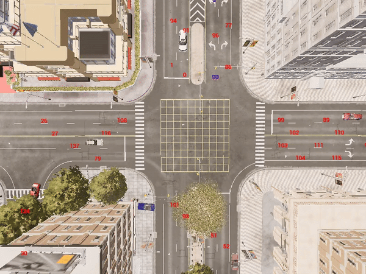
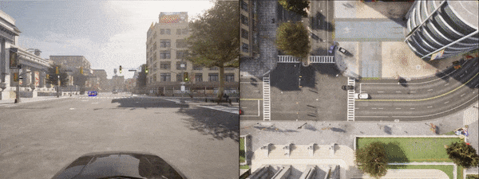
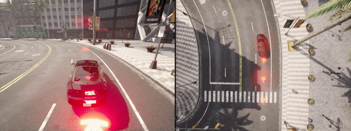
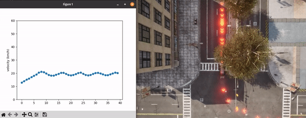

## Carla Tutorial (Python API)

[](https://blog.wuhanstudio.uk/blog/carla-tutorial/)

Please use Carla version 0.9.14 or other versions with compatible APIs

```
# Start the Carla Simulator
./CarlaUE4.sh -quality-level=epic -resx=800 -resy=600

# If you don't have a powerful GPU
./CarlaUE4.sh -quality-level=low -resx=800 -resy=600

# Run examples
python 01_get_started.py
python 02_sync_mode.py
python 03_RGB_camera.py
python 04_more_cameras.py
python 05_open3d_library.py
python 06_trafic_manager.py
python 07_3d_bounding_boxes.py
python 08_draw_waypoints.py
python 09_basic_navigation.py
```

### Gallery

Example 01: Get Started (Async)


Example 02: Synchronous Mode


Example 03: RGB Camera


Example 04: More Cameras


Example 05: Open3D Lidar


Example 06: Traffic Manager



Example 07: 3D Bounding Boxes



Example 08: Draw Waypoints



Example 09: Basic Navigation


